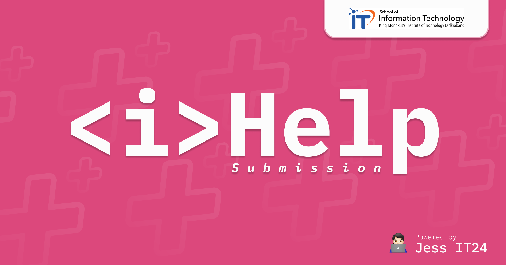

# \<i\>Help — PSCP Learning-Log Maker



Step-by-step `submission.md` / `ai_reflection.md` maker for IT KMITL PSCP
students, styled after [iJudge](https://ijudge.it.kmitl.ac.th).

The site never writes content for you: every wizard step only collects your
own words and formats them into the official course templates bundled in
`data/templates/` (Thai or English). Nothing is submitted to the OJ — you
download the finished file and submit your code yourself.

## Run

Standalone Next.js project. Uses [Bun](https://bun.sh) as the package manager /
script runner (`bun.lock`), with Next.js executing on Node.

```bash
cd ihelp
bun install   # first time only
bun run dev   # http://localhost:3000
```

Note: do not force the Bun runtime with `bun --bun next ...` — Next 16's
build crashes under Bun 1.2.x (SIGTRAP). `bun run` as above is the supported
setup.

## Features

- **Master problem list** from `data/oj_problems.json`
  (override with the `OJ_PROBLEMS_PATH` env var). Shows difficulty stars,
  expire dates, and Learning Log tags straight from the export. Per-student
  fields in the export (pass status, attempt counts) are ignored.
- **Week badges** derived from `expire_date`: the earliest distinct date =
  **Week 1**, the next = **Week 2**, and so on, with a week filter bar.
  Expired dates show in red.
- **Step-by-step md maker** — one wizard per file, one template section per
  step, with the official guidance text and collapsible _examples_ excerpted
  from the course example files (shown only to illustrate the expected level
  of detail).
- **Download to your machine** — preview the generated markdown, then
  download `submission.md` / `ai_reflection.md` and place it in your problem
  folder.
- **TH / EN toggle** — switches both the UI and which official template the
  file is generated from.
- **Drafts auto-saved** in the browser (localStorage), per problem.

## Notes

- Live status from iJudge is not fetched: iJudge's sign-in is a Next.js
  server-action flow, so there is no stable JSON API to integrate against —
  re-export `data/oj_problems.json` to refresh the list.
- Learning logs are required only for problems tagged **Learning Log**;
  the maker still works for other problems if you want notes for yourself.

## Tech stack

- [Next.js 16](https://nextjs.org) (App Router) on Node
- [Tailwind CSS](https://tailwindcss.com) + shadcn-style UI primitives
- [Bun](https://bun.sh) as package manager / script runner
- TH / EN i18n via a lightweight `LocaleProvider`

## Credits

Built and maintained by **chatann\_**.

- GitHub: [@Jesselpetry](https://github.com/Jesselpetry)
- Instagram: [@chatann\_](https://instagram.com/chatann_)

## License

Released under the [MIT License](./LICENSE) — © 2026 chatann\_.
