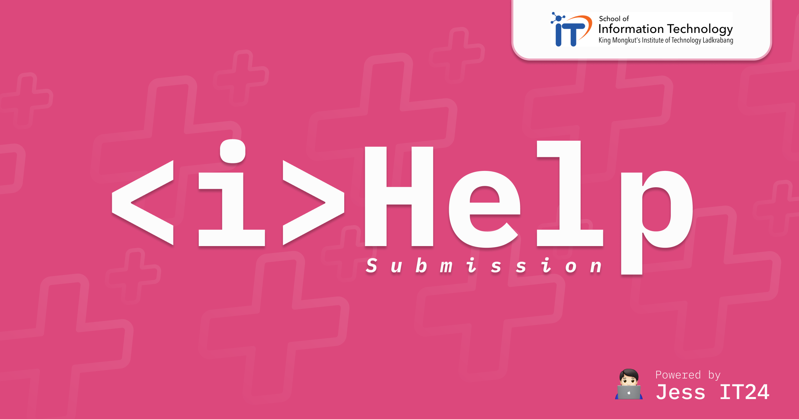

# \<i\>Help — PSCP Learning-Log Maker



เครื่องมือสร้าง `submission.md` / `ai_reflection.md` แบบทีละขั้นตอน สำหรับนักศึกษา
PSCP IT KMITL ดีไซน์ตามสไตล์ [iJudge](https://ijudge.it.kmitl.ac.th)

เว็บนี้ไม่เขียนเนื้อหาแทนคุณ — ทุกขั้นตอนเก็บคำตอบที่คุณเขียนเอง แล้วจัดลง
template ทางการของรายวิชา (ไทย/อังกฤษ) จากนั้นดาวน์โหลดไฟล์ไปส่งเอง
ไม่มีการส่งอะไรไปที่ OJ

## วิธีรัน

ใช้ [Bun](https://bun.sh) เป็น package manager / script runner โดย Next.js รันบน Node

```bash
cd ihelp
bun install   # ครั้งแรกครั้งเดียว
bun run dev   # http://localhost:3000
```

หมายเหตุ: ห้ามใช้ `bun --bun next ...` — Next 16 build จะ crash บน Bun 1.2.x (SIGTRAP)

## ฟีเจอร์

- **รายการโจทย์** จาก `data/oj_problems.json` (override ได้ด้วย env `OJ_PROBLEMS_PATH`)
  พร้อมระดับความยาก วันหมดเขต ป้าย Learning Log และแท็บกรองรายสัปดาห์
- **Wizard ทีละขั้นตอน** ตาม template ทางการ พร้อมคำแนะนำและตัวอย่างจากรายวิชา
- **Preview + ดาวน์โหลด** ไฟล์ `submission.md` / `ai_reflection.md`
- **แบบร่างบันทึกอัตโนมัติ** ใน browser (localStorage) แยกตามโจทย์
- **ประวัติไฟล์ที่สร้าง** (`/history`) — ทุกไฟล์ที่ generate ถูกเก็บในเครื่อง
  ดูย้อนหลัง โหลดซ้ำ ลบได้ ไม่มีข้อมูลออกจาก browser
- **ห้องสมุด** (`/library`) — อ่านเอกสาร AI-Guidelines-PSCP ทั้งชุดแบบหนังสือ
  (bundle อยู่ใน `data/ai-guidelines/`, override ด้วย env `AI_GUIDELINES_PATH`)
- **ทางลัดประจำสัปดาห์** บนหน้าแรก — แก้ลิงก์ได้ที่ `lib/shortcuts.ts`
- **สลับ TH / EN** ทั้ง UI และภาษาของ template ที่ใช้สร้างไฟล์

## Tech stack

- [Next.js 16](https://nextjs.org) (App Router) บน Node
- [Tailwind CSS](https://tailwindcss.com) + shadcn-style UI
- [Bun](https://bun.sh) เป็น package manager

## ร่วมพัฒนา

Open source — อยากอัปเดตรายการโจทย์สัปดาห์ใหม่ แก้บั๊ก หรือเพิ่มฟีเจอร์
อ่าน [CONTRIBUTING.md](./CONTRIBUTING.md)

## เครดิต

สร้างและดูแลโดย **Chatan Petry** — GitHub: [@Jesselpetry](https://github.com/Jesselpetry) ·
Instagram: [@chatann\_](https://instagram.com/chatann_)

## License

[MIT License](./LICENSE) — © 2026 Chatan Petry
