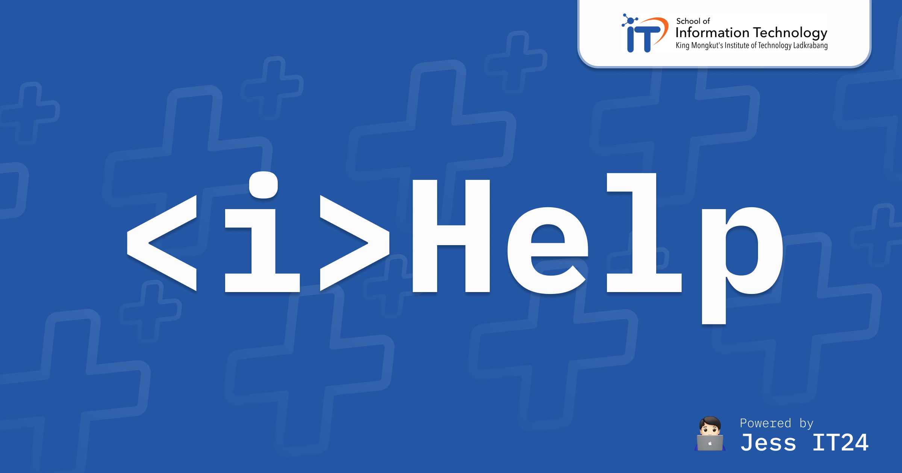

# \<i\>Help — คลังการเรียนรู้ IT KMITL



ศูนย์รวมสื่อการเรียนของนักศึกษา IT สจล. ปี 1 — สรุปเนื้อหา สไลด์บรรยาย ข้อสอบเก่า
แบบฝึกหัด และเครื่องมือสร้าง Learning Log ของวิชา PSCP รวมอยู่ในเว็บเดียว
ดีไซน์ตามสไตล์ [iJudge](https://ijudge.it.kmitl.ac.th)

**14 รายวิชา · 679 การ์ดสื่อการเรียน · 662 ไฟล์**

<p>
  
  
  
  
  
  
  
  
  
</p>

> เว็บนี้ไม่เขียนเนื้อหาแทนคุณ — เครื่องมือสร้างไฟล์ทุกตัวเก็บคำตอบที่คุณเขียนเอง
> แล้วจัดลง template ทางการของรายวิชา ไม่มีการส่งอะไรไปที่ OJ

## วิธีรัน

ใช้ [Bun](https://bun.sh) เป็น package manager / script runner โดย Next.js รันบน Node

```bash
cd ihelp
bun install   # ครั้งแรกครั้งเดียว
bun run dev   # http://localhost:3000
```

หมายเหตุ: ห้ามใช้ `bun --bun next ...` — Next 16 build จะ crash บน Bun 1.2.x (SIGTRAP)

## ภาพรวม

เนื้อหาแบ่งเป็น **track** ต่อรายวิชา นักศึกษาไล่จากบนลงล่างได้เลย

| Track          | คืออะไร                                             |
| -------------- | --------------------------------------------------- |
| ภาพรวมรายวิชา  | ขอบเขตรายสัปดาห์ หน่วยกิต ผู้สอน สัดส่วนคะแนน       |
| สรุปเนื้อหา    | ชีทสรุปอ่านต่อเนื่อง พร้อมสารบัญด้านข้าง            |
| แบบทดสอบ       | ควิซพร้อมคำอธิบายว่าทำไมตัวเลือกอื่นผิด             |
| ข้อสอบจำลอง    | ข้อสอบชุดเต็มพร้อมเฉลยแสดงวิธีทำ                    |
| คลังโจทย์      | โจทย์ฝึกและโจทย์ OJ พร้อมกำหนดส่ง                   |
| คลังทรัพยากร   | สไลด์ PDF ข้อสอบเก่า ภาพสมุดจด                      |

track ที่ยังไม่เสร็จจะโชว์เป็นช่องล็อก เพื่อให้เห็น roadmap ทั้งหมด และแยกออกว่า
“ยังไม่ทำ” กับ “ไม่มี”

### รายวิชาที่มีอยู่

**ปี 1 เทอม 1** — ITF · ICS · MFIT · PSCP · CHARM · FE · SPORT
**ปี 1 เทอม 2** — BFIT · DSA · OOP · PSTAT · FE2 · DL
**EN-KMITL** (ลงข้ามคณะ) — ComPro · General Chemistry

### คลังทรัพยากร (Media Library)

สื่อทุกชิ้นจัดกลุ่มตาม **ขอบเขตสอบ** — ก่อนมิดเทอม / หลังมิดเทอม — โดยเส้นแบ่งของ
แต่ละวิชาอ่านจาก `summary.md` ของวิชานั้น ไม่ได้เดาจากเลขสัปดาห์ในชื่อไฟล์
(ITF/ICS/MFIT/PSCP แบ่งที่สัปดาห์ 7, DSA/PSTAT ที่บทที่ 7, BFIT ที่สัปดาห์ 8)
สื่อที่คร่อมทั้งเทอม เช่นแผนการสอนหรือตารางค่าวิกฤต จะโชว์ใต้ทั้งสองหมุด

การ์ดมาจากสองชั้น: entry ที่เขียนมือใน `lib/subject-library.ts` (มีชื่อสองภาษา
คำอธิบาย และขอบเขตสอบ) ซ้อนบน manifest ที่ scan จากไฟล์จริง — ไฟล์ที่วางลง
`public/assets/` ตามกติกาจะได้การ์ดของตัวเองโดยไม่ต้องรอใครมาเขียน entry

**ตัวไฟล์ไม่ได้อยู่ใน repo** — `public/assets/` ถูก gitignore ไว้ ไฟล์จริงอยู่บน
Supabase Storage และเว็บเสิร์ฟจากที่นั่น (`lib/asset-url.ts` แปลง path
`/assets/…` เป็น URL ของ bucket) เก็บไฟล์ไว้ในเครื่องต่อได้เพื่อให้
`library:build` scan ได้ แต่ต้องรัน `assets:sync` เพื่ออัปโหลดขึ้น bucket
ไม่งั้นไฟล์จะ 404 บน production ทั้งที่เปิดได้ในเครื่อง

เหตุผล: PDF ~908 MB ทำให้ git pack โต 881 MB และ build output ทะลุ 1 GB
จน build container ของ Vercel เนื้อที่หมด (ENOSPC)

### ข้อสอบเก่า — เฉพาะ insider

**ข้อสอบเก่าเป็นเนื้อหาที่จำกัดสิทธิ์** ไม่เสิร์ฟให้สาธารณะ ไฟล์อยู่ใน bucket
แบบปิด `ihelp-library-exams` เข้าถึงผ่าน signed URL อายุ 10 นาที หลังผ่าน
`isInsider()` แล้วเท่านั้น (`lib/library-exams.ts` → `/api/library/exams`)

การจัดว่าอะไรเป็นข้อสอบดูจาก `category === "exam"` **ไม่ใช่ path** — หน้าข้อสอบ
ที่ถ่ายมาเก็บไว้ที่ `/assets/it-kmitl/ics/pages/pg-*.jpg` อยู่นอกโฟลเดอร์
`exams/` ถ้าใช้ path ตัดสินจะหลุดสาธารณะทันที ดู `isRestrictedAsset()` ใน
`lib/subject-library-ui.ts`

### คลังเรียนรู้ต้องเข้าสู่ระบบ

`/courses/<วิชา>/library` เปิดให้เฉพาะ**นักศึกษาคณะ IT ที่เข้าสู่ระบบแล้ว** —
อีเมล `@kmitl.ac.th` ที่รหัสนักศึกษามีรหัสคณะ `07` (กติกาเดียวกับทั้งแอป ดู
`lib/auth/verify.ts`) ยังไม่เข้าสู่ระบบจะเห็นหน้าให้ล็อกอินแทน

เป็นการกันจริงฝั่ง server ไม่ใช่แค่ซ่อน UI — หน้านี้ยัง prerender เป็น static แต่
**ไม่มีข้อมูลไฟล์อยู่ในหน้าเลย** รายการสื่อมาจาก `/api/library/assets` ซึ่งตอบ 401
ถ้าไม่มี session ที่ผ่านการยืนยัน ผู้ที่ไม่ได้ล็อกอินจึงหาอะไรไม่เจอทั้งใน HTML,
ใน RSC payload และจากการยิง API ตรง ๆ

เหตุผล: `summary.md` ของ Foundation English ระบุว่า workbook ของ Edusoft
*ให้เก็บไว้หลังระบบล็อกอินเท่านั้น* และ IT-Fundamentals ระบุว่าสไลด์บรรยาย
*ห้ามเผยแพร่สาธารณะ* — การล็อกอินคือสิ่งที่ทั้งสองข้อต้องการจริง ๆ

ข้อสอบเก่ายังเป็นอีกชั้นซ้อนอยู่ข้างใน: ต้องเป็น insider เท่านั้น

รายละเอียดโครงสร้าง กติกาตั้งชื่อ และ taxonomy กลางภาค/ปลายภาค อยู่ใน
**[FILE_STRUCTURE.md](./FILE_STRUCTURE.md)**

มีไฟล์กองใหญ่ที่ยังไม่ได้จัดหมวด — วางลง `_dropzone/` แล้วชี้ AI agent ไปที่
**[docs/DROPZONE_SOP.md](./docs/DROPZONE_SOP.md)** เดี๋ยวจัดให้ทั้งชุด

## ฟีเจอร์เครื่องมือ PSCP

- **รายการโจทย์** จาก `data/oj_problems.json` (override ได้ด้วย env `OJ_PROBLEMS_PATH`)
  พร้อมระดับความยาก วันหมดเขต ป้าย Learning Log และแท็บกรองรายสัปดาห์
- **Wizard ทีละขั้นตอน** ตาม template ทางการ พร้อมคำแนะนำและตัวอย่างจากรายวิชา
- **Preview + ดาวน์โหลด** ไฟล์ `submission.md` / `ai_reflection.md`
- **แบบร่างบันทึกอัตโนมัติ** ใน browser (localStorage) แยกตามโจทย์
- **ประวัติไฟล์ที่สร้าง** (`/history`) — เก็บในเครื่อง ดูย้อนหลัง โหลดซ้ำ ลบได้
  ไม่มีข้อมูลออกจาก browser
- **ห้องสมุด** (`/library`) — อ่านเอกสาร AI-Guidelines-PSCP ทั้งชุดแบบหนังสือ
  (bundle อยู่ใน `data/ai-guidelines/`, override ด้วย env `AI_GUIDELINES_PATH`)
- **ทางลัดประจำสัปดาห์** บนหน้าแรก — แก้ลิงก์ได้ที่ `lib/shortcuts.ts`
- **สลับ TH / EN** ทั้ง UI และภาษาของ template ที่ใช้สร้างไฟล์
- **Push ขึ้น GitHub** (ไม่บังคับ) — push ไฟล์เข้า repo ของคุณที่
  `oj<id>/submission.md` และ `oj<id>/ai_reflection.md` ได้โดยตรง ทั้งจากหน้า wizard
  และหน้า `/history` หน้าแรกจะแสดงป้ายว่าโจทย์ไหน upload แล้ว
- **หน้าแก้ไฟล์ใน repo** (`/repo`) — ดูไฟล์ทั้งหมดใน repo, แก้ `submission.md` /
  `ai_reflection.md` ได้ทั้งแบบ **Raw** และ **ทีละขั้นตอน** (ถอดกลับจากไฟล์เป็น
  ฟอร์มคำถามอัตโนมัติ), สร้างไฟล์ใหม่ และ commit ขึ้น repo ได้จากหน้าเดียว

## ตั้งค่า Push ขึ้น GitHub (ไม่บังคับ)

ฟีเจอร์นี้ใช้ GitHub OAuth App — access token เก็บใน httpOnly cookie เท่านั้น
(ไม่อยู่ใน localStorage) ทุก request ไป GitHub ผ่าน route ฝั่ง server ที่
`app/api/github/*`

1. สร้าง OAuth App ที่ <https://github.com/settings/developers> → **New OAuth App**
   - Authorization callback URL: `<app-url>/api/github/callback`
     (เพิ่ม `http://localhost:3000/api/github/callback` สำหรับ dev)
2. คัดลอก `.env.example` เป็น `.env.local` แล้วกรอก `GITHUB_OAUTH_CLIENT_ID`,
   `GITHUB_OAUTH_CLIENT_SECRET` และ `NEXT_PUBLIC_APP_URL`
3. รันแอป กด **Sign in with GitHub** บนหน้าแรก แล้วเลือก repository ปลายทาง

> scope ที่ขอคือ `public_repo` (เขียน public repo ได้) หากต้องการ push เข้า
> private repo เปลี่ยนเป็น `repo` ที่ `OAUTH_SCOPE` ใน `lib/github-server.ts`

## Tech stack

ทุกตัวในนี้ใช้งานจริง — คืออะไร และทำอะไรใน codebase นี้

### Framework & ภาษา

<table>
  <tr>
    <td align="center" width="96">
      <br>
      <sub><b>Next.js 16</b></sub>
    </td>
    <td><strong>App Router</strong> รันบน Node (ห้าม <code>bun --bun next</code> — build crash SIGTRAP บน Bun 1.2.x) หลาย route เป็น <code>force-static</code> เพื่ออยู่ในโควตา 12 serverless function ของ Vercel Hobby · redirect ของ route เก่าอยู่ใน <a href="proxy.ts">proxy.ts</a> · dev รันบน Turbopack</td>
  </tr>
  <tr>
    <td align="center" width="96">
      <br>
      <sub><b>React 19</b></sub>
    </td>
    <td>เรนเดอร์ทั้งหมด ส่วนใหญ่เป็น Server Component — หน้า <code>/pscp</code> โหลด registry ตอน build, ฝั่ง client มีแค่ตัวกรอง/มุมมองตาราง-การ์ดและ workspace drawer</td>
  </tr>
  <tr>
    <td align="center" width="96">
      <br>
      <sub><b>TypeScript 5</b></sub>
    </td>
    <td>ทั้ง codebase · <code>lib/schemas/content.ts</code> + <code>npm run content:check</code> ตรวจคลังข้อสอบตอน build — ทุกข้อต้องมีแหล่งอ้างอิง ตัวเลือกห้าม id ซ้ำ progress key ห้ามชน</td>
  </tr>
</table>

### UI & Styling

<table>
  <tr>
    <td align="center" width="96">
      <br>
      <sub><b>Tailwind 4</b></sub>
    </td>
    <td>Styling ทั้งเว็บ ผ่าน <code>@tailwindcss/postcss</code> ไม่มี <code>tailwind.config</code> · token อยู่ใน <a href="app/globals.css">globals.css</a> · ธีม PSCP Pink (<code>--primary</code> = <code>#db2777</code> / dark <code>#ec4899</code>) rebind ต่อ scope · <code>tw-animate-css</code> สำหรับ animation utility</td>
  </tr>
  <tr>
    <td align="center" width="96">
      <br>
      <sub><b>Radix UI</b></sub>
    </td>
    <td>Primitive ที่เข้าถึงได้ใน <a href="components/ui/">components/ui/</a> — dialog, select, tabs ฯลฯ ใช้ที่ที่ focus trap และคีย์บอร์ดสำคัญกว่าสไตล์ เช่น workspace drawer ของโจทย์</td>
  </tr>
  <tr>
    <td align="center" width="96">
      <br>
      <sub><b>shadcn/ui</b></sub>
    </td>
    <td>วิธีที่ primitive พวกนั้นมาถึง — generate ลง repo (<a href="components.json">components.json</a>, base neutral, CSS variable) ไม่ได้ลงเป็น dependency แต่ละตัวจึงเป็น source ที่แก้ได้ ใช้ convention <code>cn()</code> + <code>cva</code></td>
  </tr>
  <tr>
    <td align="center" width="96">
      <br>
      <sub><b>Lucide</b></sub>
    </td>
    <td>ไอคอนชุดเดียวทั้งเว็บ (<code>lucide-react</code>) มากับ shadcn/ui</td>
  </tr>
</table>

### เนื้อหา & Markdown

<table>
  <tr>
    <td align="center" width="96">
      <br>
      <sub><b>react-markdown</b></sub>
    </td>
    <td>เรนเดอร์สรุปเนื้อหา ชีท และเอกสาร AI-Guidelines ทุกหน้า pipeline: <code>remark-gfm</code> + <code>remark-frontmatter</code> + <code>remark-math</code> → <code>rehype-katex</code> · สารบัญด้านข้างแบบ scroll-spy สร้างจาก heading ที่ parse ได้</td>
  </tr>
  <tr>
    <td align="center" width="96">
      <br>
      <sub><b>KaTeX</b></sub>
    </td>
    <td>สูตรคณิตศาสตร์ใน markdown (MFIT, PSTAT, DL) รองรับ inline <code>$…$</code> และ block <code>$$…$$</code> หลายบรรทัด</td>
  </tr>
  <tr>
    <td align="center" width="96">
      <br>
      <sub><b>Pyodide</b></sub>
    </td>
    <td>รัน Python ตรวจโจทย์ในเบราว์เซอร์ (WebAssembly) ใน Web Worker — client-side grader ของ <code>/recommended/[slug]</code> ไม่ส่งโค้ดขึ้น server และไม่ยิงอะไรไป OJ</td>
  </tr>
</table>

### ข้อมูล & แพลตฟอร์ม

<table>
  <tr>
    <td align="center" width="96">
      <br>
      <sub><b>Supabase</b></sub>
    </td>
    <td>Auth (Google OAuth จำกัด <code>@kmitl.ac.th</code> รหัสคณะ <code>07</code> ผ่าน <code>@supabase/ssr</code>) + Storage — สื่อการเรียน 670 ไฟล์ (~908 MB) อยู่บน bucket ไม่ได้อยู่ใน git ข้อสอบเก่าอยู่ bucket แบบปิด เสิร์ฟผ่าน signed URL อายุ 10 นาที</td>
  </tr>
  <tr>
    <td align="center" width="96">
      <br>
      <sub><b>Drizzle ORM</b></sub>
    </td>
    <td>Schema ใน <a href="db/">db/</a> ต่อ Postgres ผ่านไดรเวอร์ <code>postgres</code> · <code>drizzle-kit</code> สำหรับ generate / push / studio (<a href="drizzle.config.ts">drizzle.config.ts</a>) เก็บโปรไฟล์ผู้ใช้ ทรัพยากรที่แชร์ ตัวนับผู้เข้าชม</td>
  </tr>
  <tr>
    <td align="center" width="96">
      <br>
      <sub><b>Zod</b></sub>
    </td>
    <td>Schema ของ content contract และ payload ฟอร์ม — ตรวจฝั่ง client เป็นชั้น UX ส่วน API ตรวจแยกอิสระ</td>
  </tr>
  <tr>
    <td align="center" width="96">
      <br>
      <sub><b>Vercel</b></sub>
    </td>
    <td>Deploy target (Hobby) · <code>@vercel/analytics</code> + <code>@vercel/speed-insights</code> mount ใน root layout · <code>prebuild</code> รัน <code>content:check</code> ก่อนทุก build</td>
  </tr>
  <tr>
    <td align="center" width="96">
      <br>
      <sub><b>Bun</b></sub>
    </td>
    <td>Package manager / script runner — <code>bun.lock</code> เป็น lockfile ที่ commit ไว้ Next.js เองยังรันบน Node</td>
  </tr>
  <tr>
    <td align="center" width="96">
      <br>
      <sub><b>ESLint</b></sub>
    </td>
    <td>Flat config (<a href="eslint.config.mjs">eslint.config.mjs</a>) บน <code>eslint-config-next</code> · ยังไม่มี test runner — <code>lint</code> + <code>content:check</code> + build ที่ผ่านคือ gate ตอนนี้</td>
  </tr>
</table>

**ไลบรารีเสริม:** <code>react-easy-crop</code> (ครอบรูปโปรไฟล์ในเบราว์เซอร์ ย่อเป็น WebP 512px) · <code>class-variance-authority</code> + <code>tailwind-merge</code> + <code>clsx</code> (ตัวช่วย <code>cn()</code>) · <code>katex</code> โหลด CSS แยกใน layout

## Scripts

```bash
bun run dev              # dev server
bun run build            # production build
bun run lint             # eslint
bun run library:build    # สร้าง manifest + stats ของคลังทรัพยากรใหม่
bun run assets:sync      # อัปโหลดไฟล์ใน public/assets/ ขึ้น Supabase Storage
```

`library:build` ต้องรันทุกครั้งที่เพิ่ม/ลบ/เปลี่ยนชื่อไฟล์ใน `public/assets/`
จากนั้นต้อง `assets:sync` ด้วย — อัปโหลดเฉพาะไฟล์ที่ bucket ยังไม่มี และแยก
ข้อสอบเก่าไปเข้า bucket แบบปิดให้เองตามกติกาเดียวกับ `isRestrictedAsset()`

## ร่วมพัฒนา

Open source — อยากเพิ่มวิชาใหม่ เขียนสรุป อัปเดตโจทย์ แก้บั๊ก หรือเพิ่มฟีเจอร์
อ่าน [CONTRIBUTING.md](./CONTRIBUTING.md) และ [FILE_STRUCTURE.md](./FILE_STRUCTURE.md)

## ที่มาของสื่อการเรียน

ไฟล์สื่อการเรียนคัดมาจากคลัง `kmitl-archive` ซึ่งเป็นที่เก็บสื่อการเรียน
ของหลักสูตรตั้งแต่ปี 1 ถึงปี 4 — โปรเจกต์นี้ใช้เฉพาะส่วนปี 1 ตัวไฟล์อยู่บน
Supabase Storage ไม่ได้อยู่ใน repo

**ยังไม่เคลียร์ ก่อน deploy สาธารณะ** — สองข้อนี้ยังค้างอยู่จริง ณ ตอนนี้:

1. **ลิขสิทธิ์สื่อการสอน** — `summary.md` ของ Foundation English ระบุว่า workbook
   เป็นของ Edusoft Ltd. และให้ *เก็บไว้หลังระบบล็อกอินเท่านั้น* ส่วน
   IT-Fundamentals ระบุว่าสไลด์บรรยายเป็นเอกสารของผู้สอน *ห้ามเผยแพร่สาธารณะ
   จนกว่าจะได้รับอนุญาต* — ตอนนี้ ITF ยังมีไฟล์สาธารณะ 77 ไฟล์
2. **ข้อมูลส่วนบุคคล** — ไฟล์ที่ลงท้าย `-completed` คืองานที่ทำส่งแล้วของเจ้าของ
   repo ตอนนี้ยังเป็นสาธารณะอยู่ 27 ไฟล์

กลไกจำกัดสิทธิ์มีพร้อมแล้ว (bucket แบบปิด + `isInsider()` แบบเดียวกับข้อสอบเก่า)
เหลือแค่ตัดสินใจว่าจะเอาอะไรเข้าไปหลังประตูบ้าง

## เครดิต

สร้างและดูแลโดย **Chatan Petry** — GitHub: [@Jesselpetry](https://github.com/Jesselpetry) ·
Instagram: [@chatann\_](https://instagram.com/chatann_)

## License

[MIT License](./LICENSE) — © 2026 Chatan Petry

MIT ครอบเฉพาะ **โค้ด** สื่อการเรียน (สไลด์ ชีท ข้อสอบเก่า workbook) เป็นลิขสิทธิ์
ของผู้สอนและผู้จัดพิมพ์ตามเดิม **ไม่ได้อยู่ภายใต้ MIT** และไม่ได้อยู่ใน repo นี้ —
การ clone repo จึงไม่ได้สิทธิ์ในสื่อเหล่านั้นมาด้วย

ตราสัญลักษณ์ KMITL (`public/kmitl-seal.svg`, `public/kmitl-emblem.svg`,
`public/it-kmitl-logo.*`) เป็นเครื่องหมายของสถาบัน อยู่นอกขอบเขต MIT เช่นกัน
